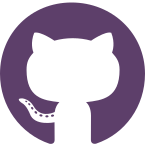
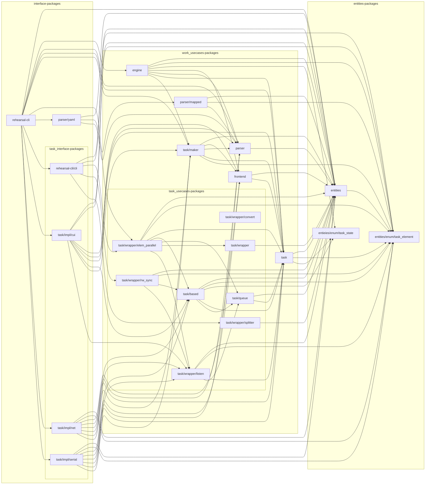

<!-- omit in toc -->
# REHEARSAL
```
 /        ____     ____    _  _     ____    __     ____     ___     __     _    
 \(o)    /____\   /____\  //  \\   /____\  /__\   /____\   /___\   /__\   //    
   \\_  //____\\ //_____ //____\\ //_____ //  \\ //____\\ //___   //  \\ //     
   /\  // \ ___//______//______ //______///___//// \ ___//____ \ //___////      
  /  \ \\_ \\__ \\_____ \\  _ ////_____ / ____ \\\_ \\__ ____/ // ____ \\\______ 
_/\  /\_\_\ \__\ \____/  \\ \_/ \_____//_/    \_\\_\ \__\\____//_/    \_\\_____/ 
```

ハッカソン用の発表資料を公開しています。ぜひご覧ください。 [Google Slide](https://docs.google.com/presentation/d/1BZcwHe4nWJIgxGl1mR7c9_kgf23wZgf0JXtp0F24t0I/edit?usp=sharing) [Youtube](https://youtu.be/IeI_CtIQk_A)
技育展用の発表資料を公開しています。ぜひご覧ください。[Google Slide](https://docs.google.com/presentation/d/1J3_SWNBf7IMG5vJ5vbOfi0EcT-KtYTzFe77LGW7FBNw/edit?usp=sharing)
また、その他の情報についてはオンラインドキュメントをご覧ください。
[rehearsal - https://rehearsal-open.github.io](https://rehearsal-open.github.io)
## Contents


## Abstract/Target

### 動作テストを楽にしよう

　プログラムに限らず、何かプロダクトを開発するにあたり、一番時間をかけるべき場所はどこでしょうか？

　勿論、そのプロダクトが売りにしているところに時間をかけるべきではあります。しかしながら、消費者が見ているものは必ずしもその商品が売りにしているところとは限りません。要は全体を気にかけなければならないのです。とはいえ、一番売りとしたいところに時間を割くべきである、そのことには変わりありません。他は不具合が出ないような状態にしておけばよいのです。そのために、そのプロダクトが売りにしているところの次に割くべき時間は動作テストであるべきだと私は思います。

　確かに、世の中にはさまざまなテストツールが存在します。しかし、それはどこかに特化した性能だといえるでしょう。それでもある程度のニーズには応えることができます。しかし、この世の中のニーズは刻一刻と変化しており、それに追随することもまた、大変です。そのニーズに追随をするためにこのプロダクトを作りました。

> *よく勘違いされるのですが、このプログラムの思想はあくまでも「動作テストを制作しやすい・即時対応しやすい」ような環境を生み出すことに最大の意味があります。 **このプロダクトでは実際のテストコードを提供しないことにご注意ください。** その時代に応じて様々なテストコードへのアプローチがあったり、過去の遺産を流用したいというニーズに応えるものです。*

## Features

- 複数のプログラムを同時に実行し、それぞれの標準出力からデータを取得し、ほかのプログラムの標準入力にリレーさせます。
  - どのプログラムをどのような手段で実行し、標準出力をどのプログラムにリレーさせるかをまとめた `.yaml` ファイルを読み取ります。
- UART通信機能（組み込み開発テスト機能）
- TCP/UDP/UNIX通信機能

### Future Features

- アプリケーション間通信に使用しているアルゴリズムの全体的な刷新
  - 速度やメモリ使用量の観点から見直すべき点がまだまだ多い
- 設定項目を充実させたい
  
### Try and Challenges

- オニオンアーキテクチャを利用することで効率的に新しい種類のタスクを実装できるようにした

## Using Tools

  

## 依存関係図
Go言語はディレクトリベースのモジュール構造をもっています。以下のグラフはその依存関係を示しています。`github.com/rehearsal-open/rehearsal/` 以下のディレクトリに対してのみ示しています。[mermaid.js](https://mermaid-js.github.io/mermaid/#/)を使用しています。GitHubで閲覧する場合には[拡張機能](https://chrome.google.com/webstore/detail/github-%20-mermaid/goiiopgdnkogdbjmncgedmgpoajilohe)が必要となるのでご注意ください。



## Special Thanks
- ハッカソン用デモ動画作成時に [chokudai](https://mobile.twitter.com/chokudai) 様より許可をいただきAtCoder内で公開されていた [AtCoder Hueristic Contest 003](https://atcoder.jp/contests/ahc003) とそのローカルテスターを使用させていただきました。
